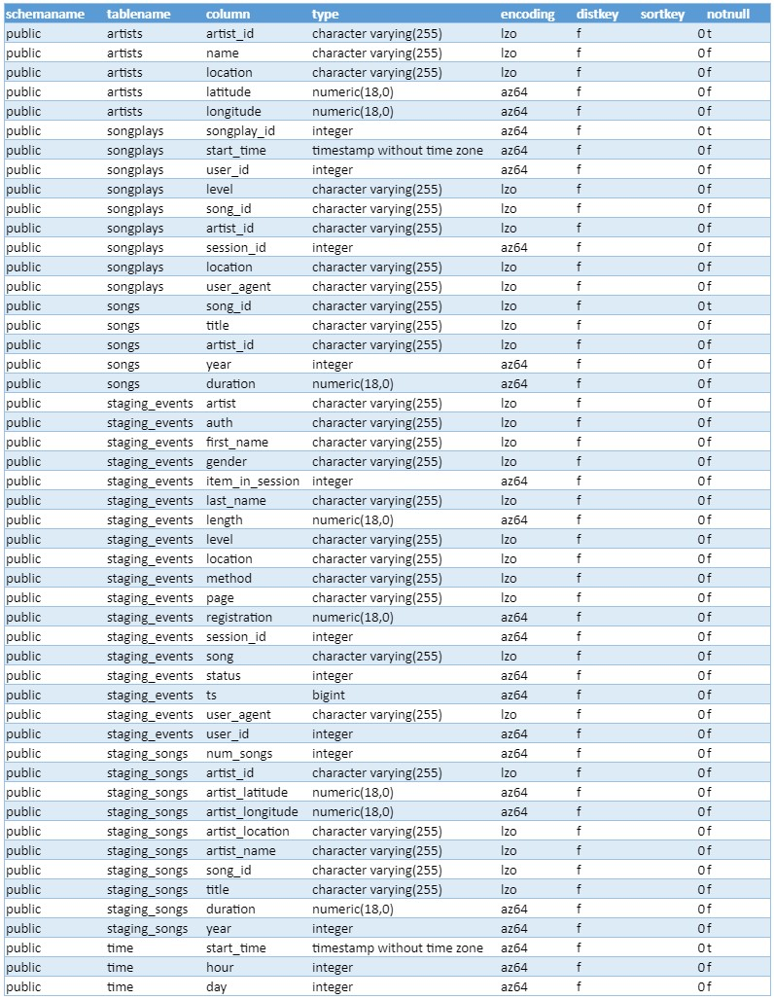

# Cloud Data Warehouses
*by Shahleem Latif*

## Introduction

Sparkify, a music streaming startup wants to update it database and has decided  to use AWS.  I as the data engineer have been instructed to use S3 as a storage resource, Redshift as a ETL tool, and Postgres as the database using all using AWS.          

## Project Steps

### Step 1

 - Create sql_queries.py file in python and write queries to create
    staging_events, staging_songs, artists, songplays, songs, time, and users tables  
 - Then write function for staging tables to transfer data from S3 into Postgre using Redshift as ETL.
 - Then also write insert queries to insert data into the tables in the
    same file

###  Step 2
    
 - Create six tables in Postgre database named staging_events,  staging_songs artists, songplays, songs, time, and users in Postgres by running create_tables.py file

### Step 3
 - Create an Extract Transfer Load file using python and name it etl.py
 
 - ETL Process: Inserted data into the two staging tables named staging_events and staging_songs using etl.py

### Step 4

 - Create an Extract Transfer Load file using python and name it etl.py
 
 - ETL Process: Inserted data into the four tables artists, songplays, songs, time, and users using etl.py

## File Structure 
The are fours files that are used to create this project for Sparkify.

1. `sql_queries.py` is where you'll define you SQL statements, which will be imported into the two other files above.
2.  `create_tables.py` is where you'll create your fact and dimension tables for the star schema in Redshift.
3.  `etl.py` is where you'll load data from S3 into staging tables on Redshift and then process that data into your analytics tables on Redshift.
4. `README.md` is where you'll provide discussion on your process and decisions for this ETL pipeline.

## Datasets
As per the Project Datasets section at Udacity, there are two datasets that you that I you will be given to develop the project.  One will contain the song data and the other will have the log data.

The two datasets files are listed below and a json path file.

-   Song data: `s3://udacity-dend/song_data`
-   Log data: `s3://udacity-dend/log_data`

Log data json path: `s3://udacity-dend/log_json_path.json`

The first dataset is a subset of real data from the [Million Song Dataset](https://labrosa.ee.columbia.edu/millionsong/). Each file is in JSON format and contains metadata about a song and the artist of that song. The files are partitioned by the first three letters of each song's track ID. For example, here are filepaths to two files in this dataset.
```
song_data/A/B/C/TRABCEI128F424C983.json
song_data/A/A/B/TRAABJL12903CDCF1A.json

```

And below is an example of what a single song file, TRAABJL12903CDCF1A.json, looks like.
```
{"num_songs": 1, "artist_id": "ARJIE2Y1187B994AB7", "artist_latitude": null, "artist_longitude": null, "artist_lo
```
```
log_data/2018/11/2018-11-12-events.json
log_data/2018/11/2018-11-13-events.json
```
And below is an example of what the data in a log file, 2018-11-12-events.json, looks like.
## Database Schema, Tables and Queries

### Redshift

#### Tablenames
```
SELECT
  DISTINCT tablename
FROM
  PG_TABLE_DEF
WHERE
  schemaname = 'public';
```
```  
artists   
songplays   
songs  
staging_events  
staging_songs  
time  
users  
```




  
> Written with [StackEdit](https://stackedit.io/).
